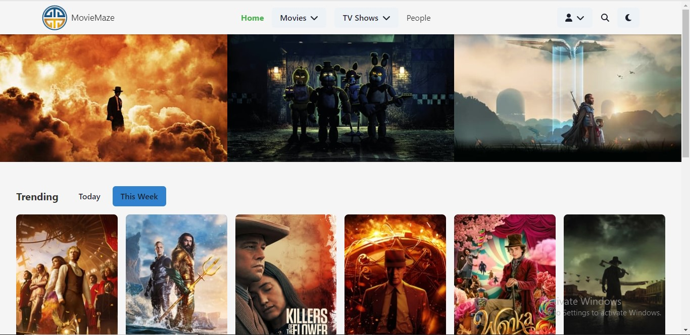
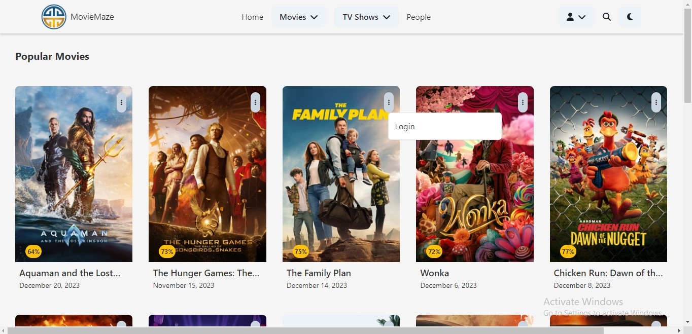
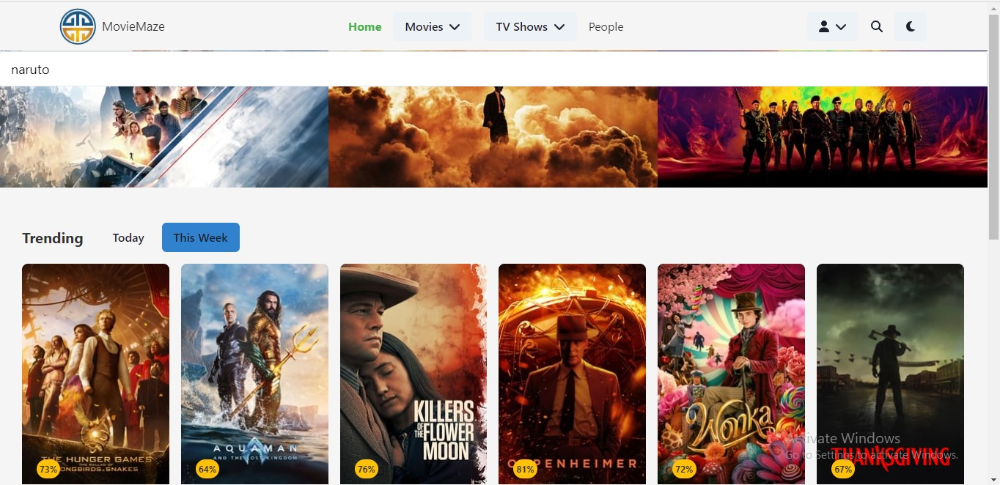
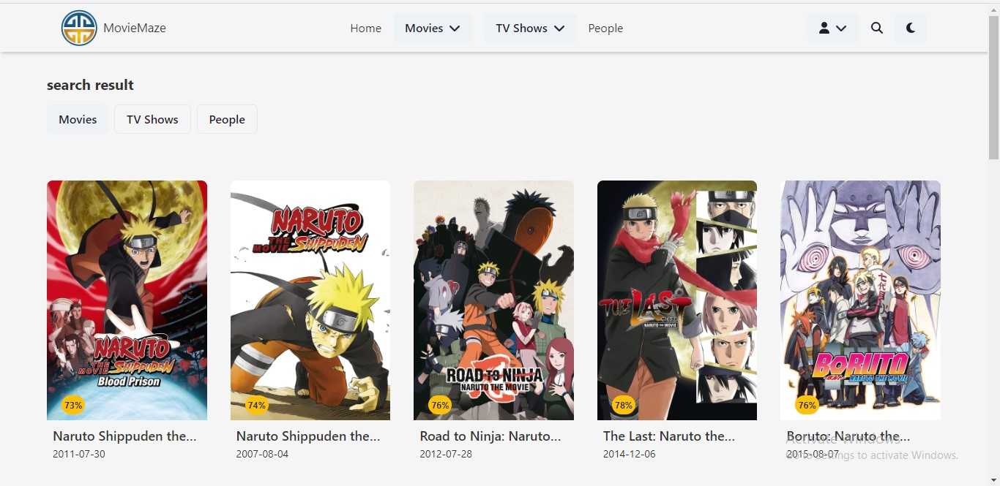
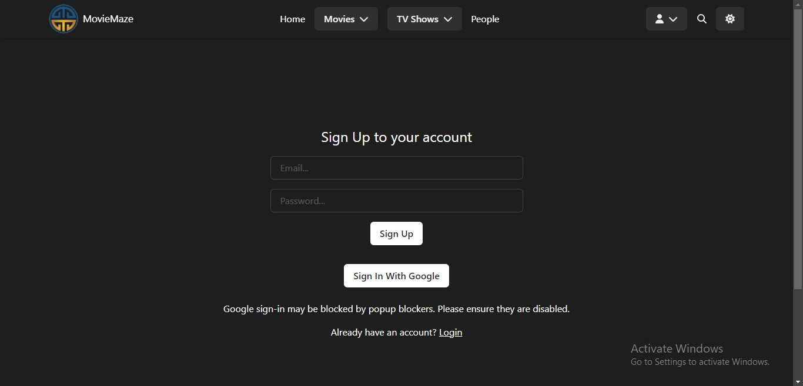
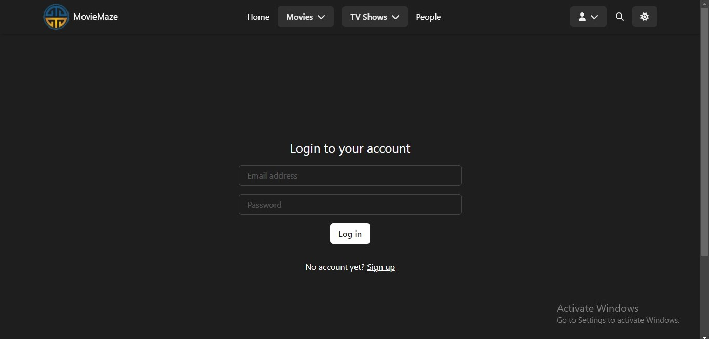
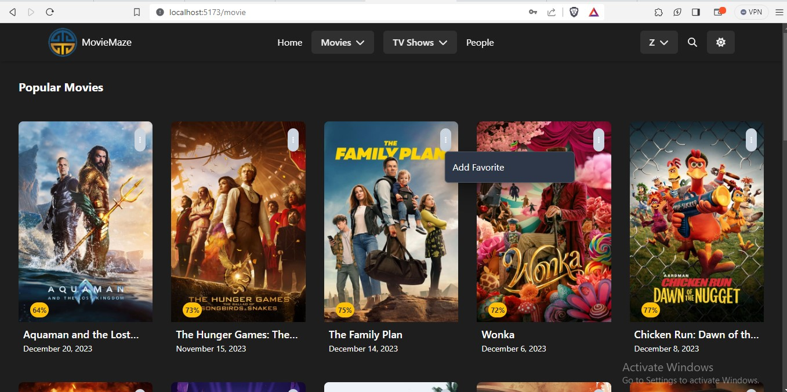
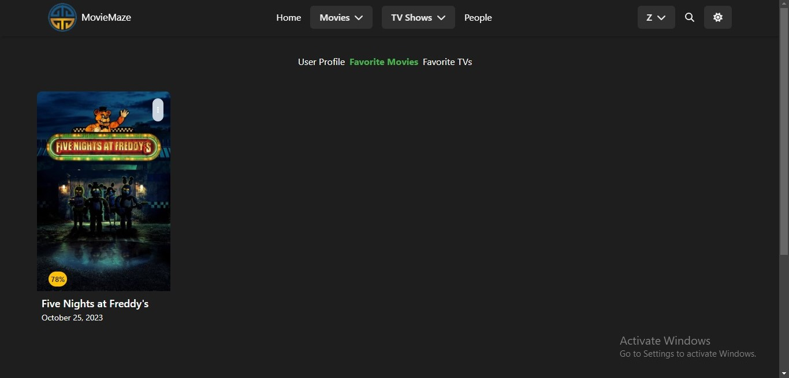

# Movie Maze

Welcome to Movie Maze - Your go-to platform for exploring popular movies, Tvs and managing your favorite Movies and TV shows!

## Table of Contents

1. [Introduction](#introduction)
2. [Features](#features)
3. [Getting Started](#getting-started)
    - [Installation](#installation)
    - [Available Scripts](#available-scripts)
4. [Usage](#usage)
    - [Website](#website)
    - [Screenshots](#screenshots)
    - [Popular Movies](#popular-movies)
    - [Popular People](#popular-people)
    - [Search](#search)
    - [Searched Result](#searched-result)
    - [Login-Register](#login-register)
    - [Register](#register)
    - [Login](#login)
    - [Add Favorite](#add-favorite)
    - [User Favorite Page](#user-favorite-page)
5. [Tech Stack](#tech-stack)
6. [Contributing](#contributing)
7. [Troubleshooting](#troubleshooting)

## Introduction

Movie Maze is a web application built with React and Chakra UI, designed to provide users with information about popular movies and allow them to manage their favorite TV shows effortlessly. The application leverages the TMDb API for fetching movie data and Firebase for user authentication and data storage.

## Features

- **Explore Popular Movies:** Discover trending and popular movies with detailed information.
- **Explore Popular TVs:** Discover trending and popular TVs with detailed information.
- **Manage Favorite Movies and TV Shows:** Users can add, view, and remove their favorite TV shows.
- **User Authentication:** Utilizes Firebase authentication for a secure and personalized experience.

## Getting Started

### Installation

1. Clone the repository:

    git clone https://github.com/ZubairAlao/movie-database-app.git
    cd /movie-database-app

2. Install dependencies with Yarn
    yarn install

### Available Scripts

- `yarn dev`: Runs the app in development mode with Vite.
- `yarn build`: Builds the app for production.
- `yarn test`: Launches the test runner.

## Usage

### Website
[Visit Movie Maze Website](https://moviemazedb.netlify.app/)

### Homepage Background

### Popular Movies

### Popular People

### Search

### Searched Result

### Login-Register

### Register

### Login

### Add Favorite

### User Favorite Page

## Tech Stack

- **React:** JavaScript library for building user interfaces.
- **Chakra UI:** A simple, modular component library for React.
- **Firebase:** A cloud-based platform for building serverless applications.
- **TMDb API:** The Movie Database API for fetching movie and TV show data.
- **Vite:** A fast frontend build tool that enhances the development experience.

## Contributing

We welcome contributions to Movie Maze! If you'd like to contribute, please follow these guidelines:

1. Fork the repository.
2. Create a new branch.
3. Make your changes and commit them.
4. Submit a pull request.

## Troubleshooting

If you encounter any issues with the installation or usage of Movie Maze, please check the following:

- Ensure that you have the latest version of Node.js and Yarn installed.
- Double-check your internet connection, especially when fetching data from external APIs.
- Refer to the project's [GitHub Issues](https://github.com/ZubairAlao/movie-database-app/issues) for known problems or solutions.

Currently, two official plugins are available:

- [@vitejs/plugin-react](https://github.com/vitejs/vite-plugin-react/blob/main/packages/plugin-react/README.md) uses [Babel](https://babeljs.io/) for Fast Refresh
- [@vitejs/plugin-react-swc](https://github.com/vitejs/vite-plugin-react-swc) uses [SWC](https://swc.rs/) for Fast Refresh
